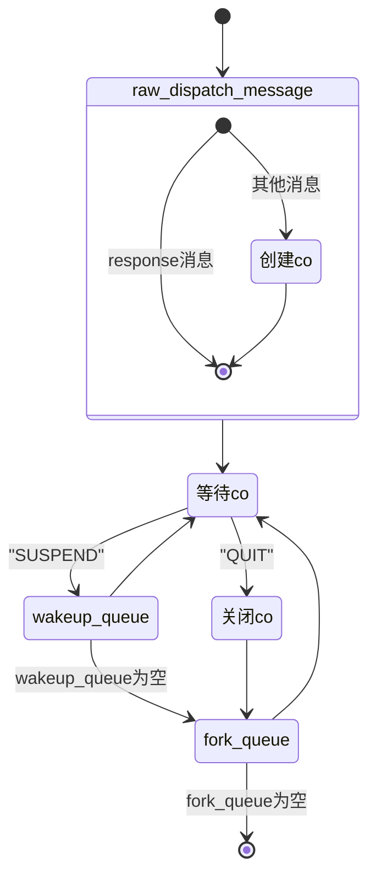
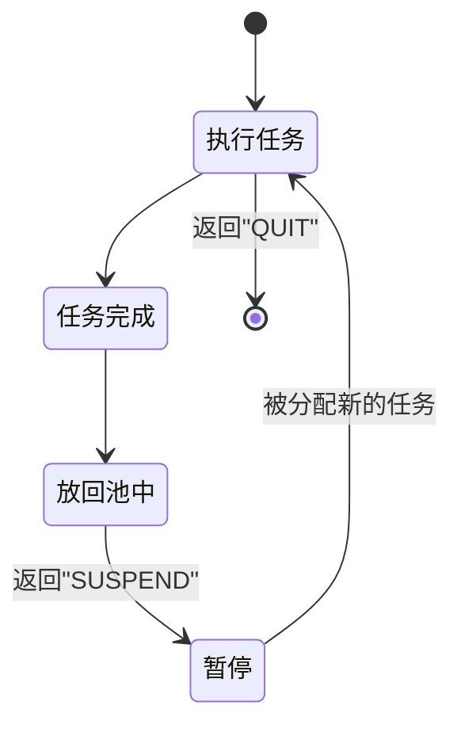
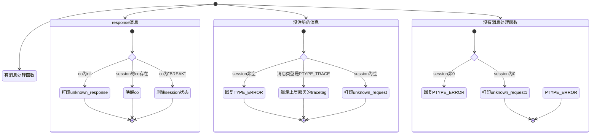

[TOC]


# lualib

## type

### <span id="handle">handle</span>

- type handle number
- 数字类型的handdle,即handle地址

### address

- type address string
- string类型的地址，以`:`开头

### localname

- type localname string
- string类型的服务名, 以`.`开头

### globalname

- type globalname string
- string类型的服务名，全大写，最多16个字符

### ptype

- type ptype integer|string

### dispatch_message_func 

- type dispatch_message_func func(prototype, msg, sz, session, source)

## loader

- 设置`SERVICE_NAME`等于当前服务文件名
- 设置`SERVICE_PATH`
- 执行`preload`


## skynet.snax.interface

### usecase

- 从文件中抽出snax服务需要实现的接口

- 默认的loader

  ```lua
  local function dft_loader(path, name, G)
  	local errlist = {}
  	for pat in string.gmatch(path,"[^;]+") do
  		local filename = string.gsub(pat, "?", name)
  		local f , err = loadfile(filename, "bt", G)
  		if f then
  			return f, pat
  		else
  			table.insert(errlist, err)
  		end
  	end
  	error(table.concat(errlist, "\n"))
  end
  ```

  

- 抽出的接口

  - `[1] = {1, "system", "init", f}`
  
  - `[2] = {2, "system", "exit", f}`
  
  - `[3] = {3, "system", "hotfix", f}`
  
  - `[4] = {4, "system", "profile", f}`
  
  - `[5] = {5, "accept", "xx1", f}`
  
  - `[6] = {6, "accept", "xx2", f}`

  - `[7] = {7, "response", "xx3", f}`
  
  - `[8] = {8, "response", "xx4", f}`
  
  - ```lua
    function accept.xx1()    
    end
    
    function accept.xx2()
    end
    
    function response.xx3()
    end
    
    function response.xx4()
    end
    
    function init()
    end
    
    function exit()
    end
    
    
    ```
  
    


## skynet

### co的状态

co的类型， 除主协程外，都称为工作协程

- 主协程，即调用dispatch_message的协程

- 消息处理协程

- fork协程

- timeout创建的协程

  - 时间到了由TIMEOUT response唤醒

    

工作协程执行结束时，会进入池中，等待再被分配任务。


主协程的流程图




工作协程流程图




消息处理流程图




### skynet.register_protocol(class {id integer, name string, ...})

- 注册消息类型
- class
  - class.trace
    - true 开启trace功能，每次消息处理函数都开启
    - false 关闭trace功能, 即使收到PTYPE_TRACE，也不会开启
    - nil skynet.trace手动开启 或者 收到PTYPE_TRACE时被动开启


### skynet.address(addr [handle](#handle)|[address](#address)): (addr [address](#address))

- 返回handle的字符串地址


### skynet.harbor(addr [handle](#handle)):(harbor_id integer, remote bool)

- 返回handle的harbor_id


### skynet.memlimit(bytes integer)

- 修改服务的最大内存限制

- 修改`service_snlua.c`中snlua结构中的mem_limit

```c
  struct snlua {
  	lua_State * L;
  	struct skynet_context * ctx;
  	size_t mem;
  	size_t mem_report;
  	size_t mem_limit;
  	lua_State * activeL;
  	ATOM_INT trap;
  };
  
  static void *
  lalloc(void * ud, void *ptr, size_t osize, size_t nsize) {
  	struct snlua *l = ud;
  	size_t mem = l->mem;
  	l->mem += nsize;
  	if (ptr)
  		l->mem -= osize;
  	if (l->mem_limit != 0 && l->mem > l->mem_limit) {
  		if (ptr == NULL || nsize > osize) {//alloc 或者 realloc
  			l->mem = mem;//恢复刚才的l->mem += nsize;
  			return NULL;
  		}
  	}
  	if (l->mem > l->mem_report) {
  		l->mem_report *= 2;
  		skynet_error(l->ctx, "Memory warning %.2f M", (float)l->mem / (1024 * 1024));
  	}
  	return skynet_lalloc(ptr, osize, nsize);
  }
  
  struct snlua *
  snlua_create(void) {
  	struct snlua * l = skynet_malloc(sizeof(*l));
  	memset(l,0,sizeof(*l));
  	l->mem_report = MEMORY_WARNING_REPORT;
  	l->mem_limit = 0;
  	l->L = lua_newstate(lalloc, l);
  	l->activeL = NULL;
  	ATOM_INIT(&l->trap , 0);
  	return l;
  }
```


### skynet.term(service handle)

- aa
  - 清除全部watching_session
  - 清除全部unresponse
- 参考skynet.kill
- 参考skynet.exit


### skynet.timeout(ti integer, f function())

- 设置超时ti后，调用f


### skynet.trace_timeout(on bool)

- trace skynet.timeout函数
- skynet.task可以返回超时没有调用和skynet.timeout


### skynet.sleep(ti, token)

- 休眠指定时间
- 设置token后可以用skynet.wakeup提前唤醒


### skynet.wait(token)

- 无限暂停
- 设置token后可以用skynet.wakeup提前唤醒


### skynet.yield()

- 让出cpu


### skynet.killthread(thread)


### skynet.self()


### skynet.localname(name [localname](.localname)): [handle](#handle)|nil

- 服务名转换成服务handle


### skynet.trace(info)

- 开启trace功能，只在当前消息处理函数生命范围内有效。
  - 如果需要每次开启，设置proto.trace=true

- 输出日志到logger服务, trace一般是在收到消息时开始调用，直到消息处理函数结束，则输出`"end"`
- <Trace $tag> trace $info
  - $tag=:handle-$traceid
  - $traceid是自增的
- <Trace $tag> request
- <Trace $tag> response
- <Trace $tag> call
- <Trace $tag> sleep
- <Trace $tag> error
- <Trace $tag> end


### skynet.tracetag()

- 返回当前的$tracetag
- 调用skynet.trace时会设置$tracetag


### skynet.starttime():integer

- 返回启动时间


### skynet.time():integer

- 返回当前时间


### skynet.exit()

- 关闭自身服务，比`skynet.kill(name)`更安全

- 可以用`skynet.monitor`监控退出的服务

- 清理工作

  - 调用 `.launcher`的`REMOVE`

  - 清理`session_coroutine_id`, 通知`session`不为0（即等待回复的服务）`PTYPE_ERROR`

  - 关闭`session_id_coroutine`里的`co`

  - 回复全部`unresponse` `resp(false)`

  - 清理`watching_session` 通知对方`PTYPE_ERROR`

  - 重置回调`c.callback(function() end)`

  - 清理`skynet_context` `c.command("EXIT)`

  - 关闭自身`co` `coroutine_yield "QUIT"`
  
  

### skynet.getenv(key string): string

- 获取环境变量


### skynet.setenv(key string, value string)

- 设置环境变量


### skynet.send(addr, typename, ...)

- 发送消息


### skynet.rawsend(addr, typename, msg, sz)

- 发送消息
- 参考skynet.send, 和skynet.send的区别是不会调用p.pack打包


### skynet.genid(): integer

- 生成下一个可用的session


### skynet.redirect(dest, source, typename, ...)

- 和skynet.send区别是可以指定source, 也不会调用p.pack打包，直接将内容转发


### skynet.pack(...): (msg ptr, sz integer)

- 打包


### skynet.packstring(...): string

- 和skynet.pack区别是，返回string


### skynet.unpack((msg ptr, sz integer)|msg string): ...

- 和skynet.pack相反，将数据解出来


### skynet.tostring(msg ptr, sz integer): string

- 将msg ,sz打包， 不会释放msg


### skynet.trash((msg ptr , sz integer)| msg string): void

- 如果是(msg ptr, sz integer), 则释放这个指针


### skynet.call(addr, typename, ...)

- 发送消息，并等待回复 


### skynet.rawcall(addr, typename, msg, sz)

- 和skynet.call类似，但不调用p.pack打包，也不调用p.unpack解包


### skynet.tracecall(tag, addr, typename, msg, sz)

- 当前消息处理函数生命范围内开启trace
- 被用PTYPE_TRACE使目标服务开启


### skynet.ret(msg, sz)


### skynet.contect()


### skynet.ignoreret()

- 忽略回复


### skynet.response()


### skynet.retpack(...)


### skynet.wakeup(token)


### skynet.dispatch(typename, func)


### skynet.dispatch_unknown_request(unknown)


### skynet.dispatch_unknown_response(unknown)


### skynet.fork(func, ...)


### skynet.dispatch_message(...)

- prototype的类型

  - 是response
    - 如果co已经"BREAK", 直接忽略
    - 如果co是空，则打印unknown_response警告
    - 唤醒co
  - 没注册的消息类型
    - 如果是PTYPE_TRACE, 记录trace tag
    - session非0，给对方回复一个PTYPE_ERROR
    - 打印unknown_request警告
  - 有注册的消息类型
    - 有处理函数
      - 创建co,并执行处理函数
    - 没处理函数
      - session非0， 给对方回复一个PTYPE_ERROR
      - session为0， 打印unknown_request警告

  

- 执行完所有的fork,直到他们全部结束或者suspend


### skynet.newservice(name, ...)

- 调用`.launcher`启动`snlua ...`服务
- `skynet.uniqueservice`最终也是使用skynet.newservice启动服务
- 和skynet.uniqueueservice的区别是， skynet.newservice可以启动多个相同类型的服务


### skynet.uniqueservice(global, ...)

- 用`.service`启动服务
- 如果global=true就是整个集群只能启动一个相同类型的服务
- 如果global=false或者global=nil就是当前节点只能启动一个相同类型的服务


### skynet.queryservice(global, ...)

- 到`.service`中查询服务


### skynet.error

- 输出日志到logger服务


### skynet.tracelog


### skynet.traceproto(prototype integer|string, flag bool|nil)

- 开关proto的trace功能
- flag
  - true, 每次处理消息时都会进行trace
  - false 强制关闭trace功能
  - nil 默认值， 手动调用skynet.trace(info)开启或者收到PTYPE_TRACE被动开启


### skynet.init(f function())

- 注册初始化函数，可以注册多个


### skynet.pcall


### skynet.init_service(start function())

- 仅内部调用，由skynet.start调用


### skynet.start(start_func function())

- 每个服务都需要调用一次
- skynet.init注册的函数调用完后，就会执行start_func


### skynet.endless():integer

- 和skynet.stat('endless')一样

- 返回是否`endless`,并重置`endless`为`false`

  

### skynet.mqlen():integer

- 和skynet.stat("mqlen")一样
- 返回消息队列大小


### skynet.stat(what "mqlen"|"endless"|"cpu"|"time"|"message"): integer

- `"mqlen"`
  - 返回消息队列的大小
- `"endless"`
  - 是否`endless`,并重置`endless`为false, 因为当前的`context`是活动的
- `"cpu"`
  - 如果开启了profile, 则返回cpu cost，单位microsec
- `"time"`
  - 当前回调函数中，已经经过了的时间，单位是microsec
- `"message"`
  - 已处理的消息的数量


### skynet.task(ret)


### skynet.uniqtask()


### synet.term(service)


### skynet.memlimit(bytes)


## <span id="skynet.sprotoparser">skynet.sprotoparser</span>

### type

#### <span id="skynet.sprotoparser.SprotoBin">SprotoBin</span>

### export

#### sparser.dump(str [SprotoBin](#skynet.sprotoparser.SprotoBin))

#### sparser.parse(text string, name string|nil): (bin [SprotoBin](#skynet.sprotoparser.SprotoBin))

- 参数
  - text .sproto文件的文本
  - name 名字, 只是用来日志输出

## skynet.sprotoloader

### export

#### loader.register(filename string, index integer): void

- 解析协议并保存在槽中

- 参数
  - filename 文件名
  - index 槽下标 从0开始

#### loader.load(index integer): (sproto [Sproto](#skynet.sproto.Sproto))

- 从槽中加载sproto

- 参数
  - index 槽下标, 从0开始
- 返回
  - sproto no gc版本的sproto

#### loader.save(bin [SprotoBin](#skynet.sprotoparser.SprotoBin), index integer): void

- 将sproto保存在槽中

- 参数
  - bin [skynet.sprotoparser](#skynet.sprotoparser)解析出来的协议二进制内容
  - index 槽下标 从0开始

## skynet.sproto

### type

#### <span id="skynet.sproto.SprotoType">SprotoType</span>

- struct
  - request
  - response
  - name string
  - tag integer

#### <span id="skynet.sproto.SprotoHost">SprotoHost</span>
##### host:dispatch((data ptr, sz integer)|(data string))
  - 处理消息
    - request
      - 有session, return "REQUEST", name, result, response, ud
      - 无session, return "REQUEST", name, result, nil, ud
    - response
      - 有记录response, return "RESPONSE", session, nil, ud
      - 无记录, return "RESPONSE", session, result, udjj
##### host:attach(sp [Sproto](#skynet.sproto.Sproto)): function(name string, args, session, ud)
  - 返回function(name, args, session, ud)
  - 根据协议`name`编码`args`
  - 设置`session`, `host:dispatch`时回调
#### <span id="skynet.sproto.Sproto">Sproto</span>

##### sproto:host(packagename string|nil): (host [SprotoHost](#skynet.sproto.SprotoHost))

- 创建一个host对象，用于request, response协议

- 参数

##### sproto:exist_type(typename string): bool
  - 判断是否存在结构`typename`
  - 参数
    - typename 结构名


##### sproto:encode(typename string, tbl table): string
  - 将`tbl`按`typename`结构编码
  - 线程不安全，因为内部用了一个`upvalue`做`buffer`
  - 返回`lstring`
##### sproto:decode(typename string, ...): (tbl table, sz integer)
  - 根据`typename`解码
  - `...`
    - `string`
    - `lightuserdata`, `integer`
  - - 
##### sproto:pencode(typename string, tbl table): string
  - 和`sproto.encode`类似，但多了一个`sproto.pack`步骤
##### sproto:pdecode(typename string, ...): (tbl table, sz integer)
  - 和`sproto.decode`类型，但多了一个`sproto.unpack`步骤
  - 返回
    - sz 使用的字节长度
##### sproto.queryproto(protoname string): (type [SprotoType](#skynet.sproto.SprotoType))
  - 查询协议
##### sproto:exist_proto(protoname string):bool
  - 检查是否存在协议`pname`	
##### sproto:request_encode(protoname string, tbl table): (data string, tag integer)
  - 根据`protoname`的`request`编码`tbl`
##### sproto:response_encode(protoname string, tbl table): string
  - 根据`protoname`的`response+`编码`tbl`
##### sproto:request_decode(protoname string, ...): (tbl table, sz integer, name string)|(nil, name string)
##### sproto:response_decode(protoname string, ...): (tbl table, sz integer)|(nil)
##### sproto.pack
- 压缩打包
##### sproto.unpack
- 解压缩
##### sproto:default(typename string, type nil|"REQUEST"|"RESPONSE")
  - 参数
    - `type`
      - `nil` 结构
      - `REQUEST`
      - `RESPONSE`


### export
#### sproto.new(bin):(sproto [Sproto](#skynet.sproto.Sproto))
  - 创建协议
  - 参数
    - `bin` 用`sprotoparser.parse`后的
#### sproto.sharenew(cobj):(sproto [Sproto](#skynet.sproto.Sproto))
  - 和`sproto.new`类似，但没有`gc`,`gc`就是在lua回收时自动将`c`里的内存结构释放
#### sproto.parse(text string):(sproto [Sproto](#skynet.sproto.Sproto))
  - 从`.sproto`文件创建
  - 参数
    - text .sproto文件内容


## skynet.manager

### export

#### skynet.launch(...):nil|[handle](#handle)

- 调用c.command("LAUNCH", ...) 启动服务， 可以启动c服务
- 参考`skynet.newservice`  `skynet.uniqueservice`, 如果需要启动c服务时就需要使用skynet.launch


#### skynet.kill(name [handle](#handle)|[address](#address)): void

- 杀死服务,
  - 调用`.launcher`的`REMOVE`
  - c.command("KILL", name)
  
- 参考skynet.exit
  
  

#### skynet.abort()

- 中止整个程序
  - c.command("ABORT")
    - skynet_handle_retireall()
    
    

#### skynet.register(name [globalname](#globalname)|[localname](#localname))

- 绑定服务名，可以是本地服务名或者全局服务名
- 参考skynet.name


#### skynet.name(name [globalname](#globalname)|[localname](#localname), handle [handle](#handle))

- 将handle命名为name，可以是本地服务名或者全局服务名
- 参考skynet.register


#### skynet.forward_type(map {[ptype]=ptype]}, start_func function())

- 类似skynet.start, 但会转换ptype,再调用dispatch_message


#### skynet.filter(f dispatch_message_func, start_func)

- 类似skynet.start，但对dispatch_message进行wrap


#### skynet.monitor(service string, query bool)

- 将一个服务设置成monitor服务
  - 设置`G_NODE.monitor_exit`
  - 服务退出时，monitor会收到`PTYPE_CLIENT`消息

- 如果query为true,就只查询，不启动服务

- 监控服务
  - c.command("MONITOR",  address)

## skynet.service

- 使用`service_provider`启动服务

### export

#### service.new(name, mainfunc, ...)

#### service.close(name)

#### service.query(name)

## skynet.habor

### exprt
#### habor.globalname(name globalname, handle handle): void
  - 注册全局服务名字
#### habor.queryname(name globalname): (h handle)
  - 查询全局服务名
  - 如果服务名不存在，会一直阻塞
  - 返回`handle`
#### habor.link(id habor_id)
  - 监控从节点退出状态。
#### habor.connect(id habor_id)
  - 监控从节点连接状态。
#### habor.linkmaster()
  - 监控和`.matster`的连接状态。

## skynet.mqueue

### type

#### message

- type message {session integer, addr source, ...}

### proto

#### PTYPE_QUEUE|"queue"

### export

#### mqueue.register(f function(msg message))

- 注册queue消息

- ```lua
  local mqueue = require "skynet.queue"
  mqueue.register(f)
```

#### mqueue.call(addr handle|localname, ...)

- 给服务发送`"queue"`消息

#### mqueue.send(addr handle|localname, ...)

- 给服务发送`"queue"`消息

#### mqueue.size()

- 返回消息队列的大小


## skynet.queue

- 包装消息处理函数，使得消息处理函数能按顺序执行。函数返回才算完成，挂起不算。

### type

#### queue

##### queue(f): f 

- wrap函数,使函数按顺序执行

### export

#### skynet.queue(): queue

- 创建队列


## skynet.require

- 由`loader.lua`require
- 修改`require`，使得每个模块第一次加载时可以执行`skynet.init`函数

## <span id="skynet.sharemap">skynet.sharemap</span>

---
### example

```lua
local skynet = require "skynet"
local sharemap = require "skynet.sharemap"

local mode = ...

if mode == "slave" then
--slave

local function dump(reader)
	reader:update()
	print("x=", reader.x)
	print("y=", reader.y)
	print("s=", reader.s)
end

skynet.start(function()
	local reader
	skynet.dispatch("lua", function(_,_,cmd,...)
		if cmd == "init" then
			reader = sharemap.reader(...)
		else
			assert(cmd == "ping")
			dump(reader)
		end
		skynet.ret()
	end)
end)

else
-- master
skynet.start(function()
	-- register share type schema
	sharemap.register("./test/sharemap.sp")
	local slave = skynet.newservice(SERVICE_NAME, "slave")
	local writer = sharemap.writer("foobar", { x=0,y=0,s="hello" })
	skynet.call(slave, "lua", "init", "foobar", writer:copy())
	writer.x = 1
	writer:commit()
	skynet.call(slave, "lua", "ping")
	writer.y = 2
	writer:commit()
	skynet.call(slave, "lua", "ping")
	writer.s = "world"
	writer:commit()
	skynet.call(slave, "lua", "ping")
end)

end
```


### use case

- 协程之间共享sproto

### type

#### <span id="skynet.sharemap.stm">stm</span>
- 引用着sproto编码出来的二进制内容，使之可以共享

  
#### sharemap_writer
##### sharemap_writer:copy():[stm](#skynet.sharemap.stm)
##### sharemap_writer:commit():void
#### sharemap_reader
##### sharemap_reader:update()
- 从stm中更新最新的内容，然后解码
### export
#### sharemap.register(protofile string):void
- 解析.proto文件，并保存在[sprotoloader](#skynet.sprotoloader)`的槽0中

#### sharemap.reader(typename, stmcpy [stm](#skynet.sharemap.stm)):sharemap_reader
- 参数
  - stmcpy 来自sharemap_writer:copy()
#### sharemap.writer(typename string, obj table):sharemap_writer
- 参数
  - typename sproto里的结构名
  - obj 需要编码的table
## skynet.datacenter

- 将数据保存在服务`DATACENTER`中
### export
#### datacenter.get(...)
#### datacenter.set(...)
#### datacenter.wait(...)
  - 如果数据不存在，会一直等待


## skynet.snax

### service

#### accept

#### response

#### system.init

#### system.exit

#### system.hotfix

#### system.profile

### proxy

#### post

- 对应accept

#### req

- 对应response

### export

#### snax.bind(handle, type): proxy

#### snax.newservice(name, ...): proxy

#### snax.uniqueservice(name, ...): proxy

#### snax.globalservice(name, ...): proxy

#### snax.queryservice(name): proxy

- 查询服务并返回proxy

#### snax.queryglobal(name): proxy

- 查询全局服务并返回proxy

#### snax.kill(proxy, ...)

- 关闭服务

#### snax.self()

- 返回当前服务的proxy

#### snax.exit(...)

- 退出自身服务

#### snax.hotfix(proxy, source, ...)

- 热修复

## skynet.debug

### export

#### skynet.init(skynet, {dispatch dispatch_message, suspend, resume})

#### skynet.reg_debugcmd(name string, fn)

### proto "debug"

#### MEM()

#### GC()

#### STAT()

#### KILLTASK(threadname)

#### TASK(session)

#### UNIQTASK()

#### INFO(...)

#### EXIT()

#### RUN(source, filename, ...)

#### TERM(service)

#### REMOTEDEBUG(...)

#### SUPPORT(typename)

- 是否能处理`typename`消息类型

#### PING()

- skynet.ret()

#### LINK()

- 用`call`调用LINK，如果出错就会返回错误

#### TRACELOG(proto, flag)

- 调用skynet.traceproto

## skynet.socket

### proto

#### `"socket"` `PTYPE_SOCKET`

### export

#### socket.open(addr string, port integer): (nil, err string)|id integer

- 连接，阻塞直到成功或者失败

#### socket.bind(os_fd integer): (nil, err string)|id integer

- 绑定`os_fd`

- ```lua
  socket.bind(0)
  # 绑定标准输入
  ```

#### socket.stdin(): (nil, err string)|id integer

- 绑定标准输入

#### socket.start(id integer, func)

#### socket.parse(id integer)

#### socket.shutdown(id integer)

- 关闭id

#### socket.close_fd(id)

- 关闭链接，但并没有释放id

#### socket.close(id)

- 关闭连接，并释放id
- 等级数据read完再释放id

#### socket.onclose(id, callback)

  - 设置关闭回闭
  - id不存在，也会设置成功
#### socket.warning(id, callback)

  - 处理`SKYNET_SOCKET_TYPE_WARNING`
  - id必须存在
#### socket.resolve(host): error string|table

  - 如果返回`table`,是一个地址数组
#### socket.netstat()   : table
#### socket.udp(callback, host, port)
#### socket.udp_address(addr string): (address string, port integer)
#### socket.udp_connect(id integer, addr string, port integer, callback function)
  - 连接udp
#### socket.sendto(id integer, address string, buffer)：(succ bool)
  - 发送udp数据
#### socket.limit(id integer, limit integer)
  - 设置buffer上限, 如果接收数据时超过上限，将会报错,并导致关闭
#### socket.abandon(id integer): void
  - 丢弃id,不处理消息了，交给其他处理
#### socket.listen(host string, port integer, backlog integer): (id integer, addr string, port integer)
  - 侦听, 直到收到`SOCKET_OPEN`
#### socket.disconnected(id integer): bool | nil
  - socket是否已经断开
  - `listen`id也有`connected`
#### socket.invalid(id integer): bool
#### socket.header(lstring string): (sz int)
  - lstring大小必须等于4
  - 将lstring换成长度
#### socket.lwrite(id integer, buffer): (succ bool)
#### socket.write(id integer, buffer): (succ bool)
#### socket.block(id integer)
#### socket.readline(id integer, sep string): (false)|()


### skynet.socketchannel

#### socketchannel.channel(desc):channel

- 创建channel
- desc.__backup 地址数组 
  - [{host string, port integer}]
  - [host string] port使用desc.__port
- desc.host 主机地址
- desc.port 主机端口
- desc.nodelay: bool 设置nodelay
- desc.overload: function(bool) 设置overload回调
- desc.auth: function(channel):(ok bool, message) 认证函数
  - auth可以改变host
  - auth可以修改backup

#### channel:connect(once bool)

- 如果`once`为true, 连接失败的话，1秒重试一次，总共尝试10次

#### channel:changebackup(backup): void 

#### channel:changehost(host string, port integer): void

- 修改地址，会触发重连

#### channel:close(): void

- 关闭channel

#### channel:request(request, response, padding)

#### channel:response(response)


# service-src

## databuffer

### usercase

- 当前只被[service-src/service_gate](#service-src/service_gate)用到
- 处理tcp的分包，有一个固定长度的消息头，里面是包的长度。
- messagepool是一个message的池，messagepool_list又是一个messagepool的队列，里面主要是串联起一个个message, 从池里申请和释放message
- databuffer就是从sockfd读取到的数据，里面也是一个message队列，保存着数据。

### type

#### messagepool

```c
struct messagepool {
	struct messagepool_list * pool;
	struct message * freelist;
};
```


#### messagepool_list

```c
#define MESSAGEPOOL 1023
struct messagepool_list {
	struct messagepool_list *next;
	struct message pool[MESSAGEPOOL];
};
```


#### <span id="service-src.databuffer.message">message</span>

```c

struct message {
	char * buffer;
	int size;
	struct message * next;
};
```


#### databuffer

```c
struct databuffer {
	int header;
	int offset;
	int size;
	struct message * head;
	struct message * tail;
};
```

### export

#### void databuffer_read(struct databuffer *db, struct messagepool *mp, char * buffer, int sz)

- db是一个[message](#service-src.databuffer.message)队列，从db中的队头读取数据到buffer中，如果[message](#service-src.databuffer.message)空了，就会放进[messagepool](#service-src.databuffer.messagepool)的freelist中


#### void databuffer_push(struct databuffer *db, struct messagepool *mp, void *data, int sz)

- db是一个[message](#service-src.databuffer.message)队列, 从[messagepool](#service-src.databuffer.messagepool)的freelist中拿一个[message](#service-src.databuffer.message),将数据data写进[message](#service-src.databuffer.message),再将[message](#service-src.databuffer.message)放进db的队列尾部


## hashid

### usecase
  - 将用户id转为[0-max)之间的下标

### type

#### hashid

```c
struct hashid_node {
	int id;
	struct hashid_node *next;
};

struct hashid {
	int hashmod;
	int cap;
	int count;
	struct hashid_node *id;
	struct hashid_node **hash;
};
```

- id是空闲节点列表，init时就根据max值申请好了。

### export

#### int hashid_insert(hashid *hi, int id)

#### int hashid_full(hashid *hi)

#### int hashid_remove(hashid *hi, int id)

#### int hashid_lookup(hashid *hi, int id)

#### void hashid_clear(hashid *hi)

#### void hashid_init(hashid *hi, int max)


## service_gate

### usecase

- tcp的网关，包格式是2个字节或者4个字节的长度头
- backlog全连接队列是128，无法自定义
- 消息包最大长度16M
- 接收到的连接没有设置nodelay,要自己设置
- “close"是直接close了，如果要shutdown连接的话，要自己处理
- 使用hashid将fd转为index, 因为gate->conn是一个数组
- forward时要重新申请一次内存，将数据写进，而不是直接利用messagepool里的内存，多一次拷贝


### export


## snlua

## logger

- 用于输出日志
- 启动参数
  - 参数1 日志文件路径， 如果没指定则输出到stdout

### proto PTYPE_SYSTEM

- freopen日志文件

### proto PTYPE_TEXT

- 输出日志


## <span id="harbor">habor</span>

- `slave`指定`snlua cslave`
- `habor_id`是自身的节点id
- 保存每个节点和每个节点开启的全局服务

### proto PTYPE_SYSTEM

- 发送消息给其他节点

- ```c
  struct remote_name {
  	char name[GLOBALNAME_LENGTH];
  	uint32_t handle;
  };
  
  struct remote_message {
  	struct remote_name destination;
  	const void * message;
  	size_t sz;
  	int type;
  };
  
  ```

### proto PTYPE_HARBOR

- 处理`snlua cslave`的消息

#### 'N 服务名'

- 注册服务名

#### 'S fd id'

- connect slave，并接管socket
- 置为STATUS_HANDSHAKE状态
- 给对方发送handshake

#### 'A fd id'

- accept slave，并接管socket
- 并分发之前缓存下来的消息
- 置为STATUS_HEADER状态
- 给对方发送handshake
- 

### proto PTYPE_SOCKET

- 接收到的消息转发给本地的服务

# service

## .bootstrap

- 首先启动的服务
- 启动[`.launcher`](#.launcher)
- 单节点模式(harbor_id为 0)
  - 设置standalone=true
  - 启动[`cdummy`](#.cdummy)
- 多节点模式(harbor_id非0)
  - 启动[`.cmaster`](#.cmaster)
  - 启动[`.cslave`](#.cslave)
- 章节点模式或者master节点
  - 启动[`DATACENTER`](.DATACENTER)
- 启动 [`.service`](#.service)
- 启动`main`

## <span id=".cdummy">.cdummy</span>

### proto "text"


### proto "harbor"


### proto "lua"


#### QUERYNAME(name string): (h [handle](#handle))

- 查询服务名

- 如果服务名不存在，会一直阻塞

  

#### REGISTER(name string, handle [handle](#handle)): void

- 注册服务名


#### LINK(id)

- 单节点模式下未实现


#### CONNECT(id)

- 单节点模式下未实现

  

## <span id=".launcher">.launcher</span>

- 启动服务, 可以是`snlua`服务，也可以是c服务

### proto "text"


#### LAUNCHOK


**LAUNCHOK():void**


- [skynet.init_service](#skynet.init_service)启动完后，会发送这个消息

  

#### ERROR

**ERROR():void**


- [skynet.init_service](#skynet.init_service)启动完后，会发送这个消息


### proto "lua"

#### LAUNCH

**LAUNCH(_, service string, ...): (ok bool, h [handle](#handle))**


- 启动服务, 直到收到LAUNCHOK就会返回`true`


#### REMOVE

**REMOVE（_, handle [handle](#handle), kill bool): void**


  - 删除服务, 只是从列表中删除，并不停止服务


#### QUERY

**QUERY(_, request_session): [handle](#handle)|nil**

- 查询正在启动的服务的地址


#### GC 

**GC (addr, ti)**

- 对全部服务执行gc, `skynet.send(k, "debug", "GC")`
- 获取全部服务的内存信息 `skynet.send(k, "debug", "MEM")`

```lua
-- 结果
{
    [":123456"] = "123.12 Kb (snlua console)",
    [":2223"] = "ERROR",
    [":32424"] = "TIMEOUT",
}
```


#### LIST

LIST(): table

  - 返回

```lua
-- 结果
{
    [":123456"] = "snlua console",
}
```


#### KILL

**KILL(_, handle)**

- kill掉服务，这个函数不判断服务是否存在

  - skynet.kill(handle)

```lua
-- 结果
{
    [":123456"] = "snlua console",
}
```

```lua
function command.KILL(_, handle)
	skynet.kill(handle)
	local ret = { [skynet.address(handle)] = tostring(services[handle]) }
	services[handle] = nil
	return ret
end
```


#### STAT

**STAT(source [handle](#handle), ti integer): table**

- 给所有服务发送 "debug STAT"

  - response
    - {[$address]="ERROR"|"debug STAT 返回值"}
    
```lua
-- 结果
{
    [":123456"] = {task="", mqlen=123, cpu=33, message=222},
    [":2223"] = "ERROR",
    [":32424"] = "TIMEOUT",
}
```


#### MEM

**MEM(source [handle](#handle), ti integer): table**

- 给所有服务发送`skynet.send(k, "debug", "MEM")`

```lua
-- 结果
{
    [":123456"] = "123.12 Kb (snlua console)",
    [":2223"] = "ERROR",
    [":32424"] = "TIMEOUT",
}
```


## <span id=".service">.service </span>

## <span id="SERVICE">SERVICE</span>

- 同类型的服务只能启动一个
  - 如果是global类型的服务，则整个集群只能启动一个
  - 如果是非global类型的服务，则每个节点能启动一个

 - 支持`snax`， 如果是`snax`类型的服务，则服务名会加上`snaxd.`前缀，比如`"snaxd.服务名"`
   
   
### proto "lua"
#### LAUNCH
  **LAUNCH (service_name, subname, ...):(h [handle](#handle))|(nil, err string)**

- 在本地启动服务, 会阻塞直到成功或者失败
- 如果启动失败，再次调用LAUNCH的话，会一直返回上次的错误信息        
          

#### QUERY
  **QUERY (service_name, subname):(h [handle](#handle))|(nil, err string)**
   - 查询服务,会阻塞直到成功或者失败


#### LIST
  **LIST():table**

- 从节点只列出本地的服务
- 主节点可以列出所有服务，包括从节点上的服务

```lua
-- 结果
{
    ["服务名字"] = "出错信息",
    ["服务名字"] = ":12131313", -- 服务地址
}
```


#### GLAUNCH

**GLAUNCH()**

- 和LAUNCH类似，但是是向主节点中启动服务


#### GQUERY

**GQUERY()**

- 和LAUNCH类似，但是是向主节点中查询服务


## service_provider

- 由`service/service_provider.lua` `service/service_cell.lua` `lualib/service.lua`三个源文件组成


## <span id=".cmaster">.cmaster</span>

- 保存着全局名字`global_name`
- 侦听地址在`env.standalone`
  - 听`cslave`连接, 接收`"H slave_id slave_addr"`完成握手
  - 发送`"C slave_id slave_addr"`给其他节点
  - 发送`"W n"`给当前连接的节点当前有n个节点准备连你
  
  

### master=>save

#### "W n"

- 等待n个slave节点连接上来，然后关闭侦听

#### "C slave_id slave_address"

- 连接从节点

#### "N globalname address"

- 新服务名

#### "D slave_id"

- 和slave节点断开连接后，给其他所有节点发送`"D slave_id"`
- 其他slave节点收到消息后，会断开和这个slave节点的连接


### slave=>master

#### "H slave_id slave_addr"

- slave节点连接上来时要发送`"H slave_id slave_addr"`完成握手

#### "R globalname address"

- 注册全局服务名
- 给所有节点回复`"N globalname address"`

#### "Q globalname"

- 查询服务名
- 返回`"N globalname address"`


## <span id=".cslave">.cslave</span>

- 启动[`habor`](#harbor)服务
- 连接`master` `master`配置地址, `address`配置本地地址
- 启动
  - 连接`master`,发送`H`，得到返回`W`,由此得到一共有多少个`slave`数量,除了自己
- 处理`master`发来的消息
- 收到新`slave`节点通知，然后连接，连接上去后，连接就交给[habor](#habor)处理
- `slave`之间相互之间相互连接，且权有一条链接。
- `slave`断开之后不会重连。

### proto "text"

#### "D slave_id"

- [habor](#habor)检查到slave断开，给[.cslave](#.cslave)发送断开消息

#### "Q globalname"

- [habor](#habor)查询服务地址，如果查询不到，[.cslave](#.cslave)就会到master查询

### proto "lua"

#### REGISTER(master_fd integer, name [globalname](#globalname), handle [handle](#handle)): void

- 绑定handle到globalname

#### LINK(master_fd integer, id integer)

- 监控和从节点的连接，直到断开

#### LINKMASTER()

- 监控和master的连接，直到断开

#### CONNECT(master_fd integer, id integer)

- 监控节点，直到节点连接上来

#### QUERYNAME(master_fd integer, name string):(h [handle](#handle))

- 查询服务名
- 如果服务名不存在，会到master查询
- 一直阻塞，直到master返回或者REGISTER注册了这个服务名。


## DATACENTER

- command
  - WAIT( ...)
  - QUERY(key, ...)
  - UPDATE(...)
- afa


## .multicastd

- 节点地址保存在DATACENTER `datacenter.get("multicast", id)`
- channel规则是0x7fffff00 后面8位保留，用来保存节点Id
  - 如果要订阅其他节点的channel,就自己组合相应的channel就可以了，或者通知其他方法去获得。
- COMMAND
  - USUB(source, c)
  
  - USUBR(source, c)
  
  - SUB(source, c)
  
  - SUBR(source, c)
  
  - PUB(source, c, pack, size)
  
  - DEL(source, c)
  
  - DELR(source, c)
  
  - NEW()
- interface
  - 源文件`skynet/multicast.lua`
  - new(conf)
    - conf.channel
      - 名称
      - 如果为空就生成一个
      - 如果要订阅其他节点的消息，就指定channel
    - conf.dispatch（chan, source, ...)
      - 订阅消息处理回数
  - :delete()
  - :publish(...)
  - :subscribe()
  - :unsubscribe()
  - 

## console

- 启动后读从标准输入读取命令
  - snax service_name ...
    - 启动snax服务
  - service_name ...
    - 启动snlua服务


## gate

### export

#### open(source [handle](#handle), conf {watchdog [handle](#handle), address string, port integer}): (address string, port integer)

- 启动网关
- watchdog
  - 会向watchdog发送`"socket"`消息
  - `skynet.send(watchdog, "lua", "socket", "data", fd, skynet.tostring(msg, sz))`
  - `skynet.send(watchdog, "lua", "socket", "open", fd, addr)`
  - `skynet.send(watchdog, "lua", "socket", "close", fd)`
  - `skynet.send(watchdog, "lua", "socket", "error", fd, msg)`
  - `skynet.send(watchdog, "lua", "socket", "warning", fd, size)`
- aa


### proto "lua"

#### accept(source, fd): void

- accept连接


#### kick(source, fd): void

- 断开连接


#### forward(source [handle](#handle), fd integer, client [handle](#handle)|nil, address [handle](#handle)|nil): void

- 之后收到的消息，使用PTYPE_CLIENT类型转发到address或者source中，client作为源地址


## snaxd

### usecase

- 启动snax服务时，实际只是一个handler, 这个服务是对handler的包装，实际启动的是这个服务
- 做了一些工作，处理了proto "snax"类型的协议
- 会重新设置全局变量SERVICE_NAME, SERVICE_PATH, 即去掉了前面的snax

### proto "snax"

#### system.hotfix

- 热修复

#### system.profile

- 返回一个profile_table, 记录着消息处理的个数和时间

#### system.init

- 调用handler的初始化函数


# lualib

## sharedata

- sharedata.lua

  - 每份数据都新建一个lua_State来保存

  - 数据query出来后，会调用sd.box(obj)包装一下，返回这个box给用户，然后fork一个monitor协程监控obj是否变化或者被删除，然后更新box。

- afaf


# lualib-src

## lua-crypt

### lua

#### <span id="lualib-src.lua-crypt.padding">padding</span>

- `type padding "iso7816_4" | "pkcs7"`


#### hashkey(key string): string

- 将key转为一个8字节长度的hash值


#### randomkey(): string

- 生成8字节长度的随机字符串


#### desencode(key string, raw string, padding [padding](#lualib-src.lua-crypt.padding)):string

- 使用des算法进行加密


#### desdecode(key string, data string):string

- 使用des算法解密


#### hexencode(raw string):string

- 编码成hex字符串
- 取值范围是`"0123456789abcdef"`


#### hexdecode(data string): string

- 解码hex字符串


#### hmac64

#### hmac64_md5

#### dhexchange

#### dhsecret

#### base64encode

#### base64decode

#### sha1

#### hmac_sha1

#### hmac_hash

#### xor_str


## lua-bson

- 值的类型包括

  1 `BSON_REAL`
  2 `BSON_STRING`
  3 `BSON_DOCUMENT`
  4 `BSON_ARRAY`
  5 `BSON_BINARY`
  6 `BSON_UNDEFINED`
  7 `BSON_OBJECTID`
  8 `BSON_BOOLEAN`
  9 `BSON_DATE`
  10 `BSON_NULL`
  11 `BSON_REGEX`
  12 `BSON_DBPOINTER`
  13`BSON_JSCODE`
  14 `BSON_SYMBOL`
  15 `BSON_CODEWS`
  16 `BSON_INT32`
  17`BSON_TIMESTAMP`
  18 `BSON_INT64`
  255 `BSON_MINKEY`
  127 `BSON_MAXKEY`

- 除去lua本身的类型`LUA_NUMBER` `LUA_TBOOLEAN` `LUA_TTABLE` `LUA_TNIL`  `LUA_TSTRING`, 其他bson的类型都编码成`string`, 第1个字节为0， 第2个字节为类型

  ```c
  static int
  ltype(lua_State *L) {
  	int t = lua_type(L,1);
  	int type = 0;
  	switch (t) {
  	case LUA_TNUMBER:
  		type = 1;
  		break;
  	case LUA_TBOOLEAN:
  		type = 2;
  		break;
  	case LUA_TTABLE:
  		type = 3;
  		break;
  	case LUA_TNIL:
  		lua_pushvalue(L, lua_upvalueindex(4));
  		return 1;
  	case LUA_TSTRING: {
  		size_t len = 0;
  		const char * str = lua_tolstring(L,1,&len);
  		if (str[0] == 0 && len >= 2) {
              // str[0]为0 str[1]为类型
  			return lsubtype(L, (uint8_t)str[1], (const uint8_t *)str+2, len-2);
  		} else {
  			type = 5;
  			break;
  		}
  	}
  	default:
  		return luaL_error(L, "Invalid type %s",lua_typename(L,t));
  	}
  	lua_pushvalue(L, lua_upvalueindex(type));
  	lua_pushvalue(L,1);
  	return 2;
  }
  ```

  

- aa

### lua

#### <span id="lualib-src.lua-bson.type">type</span>

`type type "number"|"boolean"|"table"|"nil"|"string"|"binary"|"objectid"|"timestamp"|"date"|"regex"|"minkey"|"maxkey"|"int64"|"unsupported"`

#### encode(val table): string

- 编码成bson

  

#### encode_order

- 编码成bson

  

#### date(t integer): date_t

- 创建date_t类型的value


#### timestamp(d integer, inc integer|nil): timestamp_t

- 创建 timestamp_t类型的value


#### regex(): regex_t

- 创建regex_t类型的value


#### binary(): binary_t

- 创建binary_t类型的value


#### objectid(id string|nil): objectid

- 创建objectid类型的value


#### int64(val integer): int64_t

- 创建int64类型的value


#### decode(data string): table

- 解码成table


#### type(val any): (str [type](#lualib-src.lua-bson.type), val any)

- 返回val的类型


#### minkey: string

#### maxkey: string

#### null: string


## <span id="lualib-src.lua-netpack">lua-netpack</span>

- 分包功能，包的格式如下

- 一个服务有一个独立的`queue`,`queue`中包含全部有效的`socket`的消息列队

  ```mermaid
  classDiagram
  class pack
  pack : int16 header 
  pack : binary content 
  ```

  

- afaf

---

title: aaa

---


### type

#### type

- type type "data"|"more"|"error"|"open"|"close"|"warning"|"init"

### lua

#### pack(data string): (msg ptr, sz integer)

- 拷贝msg
  - sz=len(data)+2
  - msg前面2个字节是len(data),后面是data

#### pop(q [queue](.lualib-src.lua-netpack.queue)): (fd integer, msg ptr, sz integer)

#### clear(q [queue](.lualib-src.lua-netpack.queue)):void

#### tostring(msg ptr, sz integer):(data string)

#### filter(q [queue](.lualib-src.lua-netpack.queue)|nil, msg ptr, sz integer): (q [queue](.lualib-src.lua-netpack.queue), type [type](.lualib-src.lua-netpack.type), fd integer, (msg string)|(msg ptr, sz integer))

- 转换socket的消息

  - `SKYNET_SOCKET_TYPE_WARNING`转为`"warning"`
  - `SKYNET_SOCKET_TYPE_ERROR`转为`"error"`
  - `SKYNET_SOCKET_TYPE_ACCEPT`转为`"open"`
  - `SKYNET_SOCKET_TYPE_CLOSE`转为`"close"`
  - `SKYNET_SOCKET_TYPE_CONNECT`转为`"init"`
  - `SKYNET_SOCKET_TYPE_DATA`转为`"data"`

- 参数

  - msg 是skynet_socket_message

    ```c
    struct skynet_socket_message {
        int type;
        int id;
        int ud;
        char * buffer;
    }
    ```

    

## lua-stm

- 被[skynet.sharemap](#skynet.sharemap)用到

### example

```lua
writer = stm.new(data)
reader = stm.copy(writer)
writer(newdata)
# 更新数据
reader()
```

### type

#### <span id="lualib-src.lua-stm.boxstm">boxstm</span>

##### boxstm((data ptr, sz integer)|(data string)): void

- 更新数据

##### boxstm:__gc()

- 释放[stm_object](#lualib-src.lua-stm.stm_object)

#### <span id="lualib-src.lua-stm.stm_object">stm_object</span>

#### boxreader

##### boxreader(function(data ptr, sz integer, ud), ud)

- 检测[stm_object](#lualib-src.lua-stm.stm_object)有没有改变，如果有改变则更新
- 回调中会返回最新的数据

##### boxreader:__gc()

- 释放[stm_object](#lualib-src.lua-stm.stm_object)

### lua

#### new((data ptr, sz integer)|(data string)): [boxstm](.lualib-src.lua-stm.boxstm)

- 新建一个writer, 可以更新里面的数据

#### newcopy(obj [stm_object](#.lualib-src.lua-stm.stm_object)): [boxreader](.lualib-src.lua-stm.boxreader)

- 将obj交给reader,不增加引用

#### copy(box [boxstm](#lualib-src.lua-stm.boxstm)]): [stm_object](#lualib-src.lua-stm.stm_object)

- 解开box, 返回里面的object, 增加对object的引用


## lua-clientsocket

- 标准输入
  - 创建一个queue关联lua_State，queue用于保存从标准输入读取的内容
  - 创建一个线程从标准输入读取数据到queue中
- afaf

### lua

#### connect(addr string, port integer): (fd integer)

- 阻塞连接
- 返回的fd已经设置的`NONBLOCK`标志


#### recv(fd integer): string|nil

- 读取数据


#### send(fd integer): void

- 发送数据
- 虽然fd是`NONBLOCK`的，但send函数会不断自旋，直到完蛋完或者出现错误


#### shutdown(fd integer, mode "r"|"w"|"rw"): void

- shutdown fd


#### close(fd integer): void

- 关闭fd


#### usleep

- 休眠


#### readstin(): string|nil

- 从标准输入读数据，如果没有的话返回nil


## lua-cluster

### lua

#### packrequest(source [handle](#handle)|string, session integer, msg ptr, sz integer):(data string, new_session integer, multi table)

- 如果sz>0x8000, 即32k, 会进行打包在multi这个table里， 这个table是一个数组，每个元素就是一部分数据


#### packpush(source [handle](#handle)|string, session integer, msg ptr, sz integer):(data string, new_session integer, multi table)

- 和`packrequest`类似


#### packtrace()


#### unpackrequest


#### packresponse(session integer, ok boolean, msg ptr, sz integer): string

- 打包response


#### unpackresponse(data string): (session integer, ok boolean, msg string, padding bool|nil)

- 如果是最后一个包了，padding为`nil`


#### append(arr table, (data ptr, sz integer)|nil): void

- 将arr看成数组，将data ,sz append进数组中，然后释放data
- 也可以是`nil`，也会被append进数组中


#### concat(arr table):(data ptr, sz integer)|nil

- arr中的第1个元素是数据的长度
- 然后将arr[2], arr[3]...中的数据连接起来，这些数据的长度加起来就是arr[1]


#### isname(name string): bool

- 是否有效的节点名, 以`@`开头


#### nodename():string

- 返回本机的节点名称
- 名称的规则是 `$hostname$pid`
- `$hostname`中的空格`" "`会被替换成`"_"`
- 如果没有`$hostname`则是`noname$pid`


# skynet-src

### skynet_module

```c
// 函数原型
typedef void * (*skynet_dl_create)(void);
typedef int (*skynet_dl_init)(void * inst, struct skynet_context *, const char * parm);
typedef void (*skynet_dl_release)(void * inst);
typedef void (*skynet_dl_signal)(void * inst, int signal);

struct skynet_module {
	const char * name;
	void * module;
	skynet_dl_create create;
	skynet_dl_init init;
	skynet_dl_release release;
	skynet_dl_signal signal;
};
```

- 动态库中要导出的函数， `$mod`中可以包含`.`,如果包含`.`,则取最后一个`.`的下一个字符作为名字的开始
  - `"$mod_create"`
  - `"$mod_init"`
  - `"$mod_release"`
  - `"$mod_signal"`


# lualib

## skynet.lua

```lua

local function co_create(f)
	local co = tremove(coroutine_pool)
	if co == nil then
		co = coroutine_create(function(...)
			f(...)
			while true do
				local session = session_coroutine_id[co]
				if session and session ~= 0 then
					local source = debug.getinfo(f,"S")
					skynet.error(string.format("Maybe forgot response session %s from %s : %s:%d",
						session,
						skynet.address(session_coroutine_address[co]),
						source.source, source.linedefined))
				end
				-- coroutine exit
				local tag = session_coroutine_tracetag[co]
				if tag ~= nil then
					if tag then c.trace(tag, "end")	end
					session_coroutine_tracetag[co] = nil
				end
				local address = session_coroutine_address[co]
				if address then
					session_coroutine_id[co] = nil
					session_coroutine_address[co] = nil
				end
				-- recycle co into pool
				f = nil
				coroutine_pool[#coroutine_pool+1] = co
				-- recv new main function f
                -- 暂停在这里， 等待新的任务
				f = coroutine_yield "SUSPEND"
				f(coroutine_yield())
			end
		end)
	else
		-- pass the main function f to coroutine, and restore running thread
		local running = running_thread
        -- 唤醒工作协程，将f给他，然后他就会马上yield, 看上面代码。
		coroutine_resume(co, f)
		running_thread = running
	end
	return co
end
```

